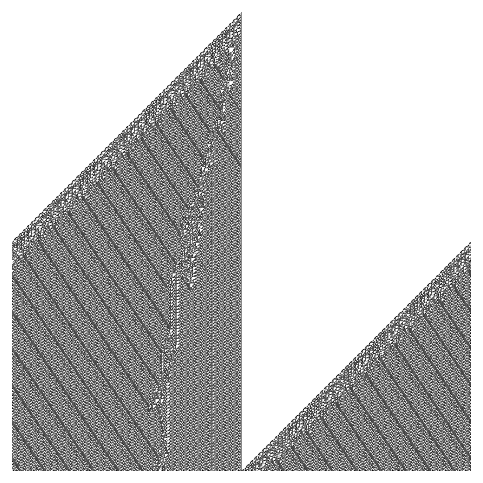
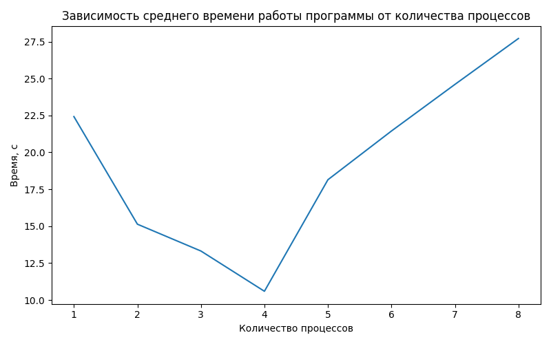

# Задание №1. Знакомство в компании.
## Запуск
```bash
mpirun --allow-run-as-root -n 4 python task1.py
```

# Задание №2. Параллельный одномерный клеточный автомат.
## Запуск
Получить картинку эволюции для правила с периодическими или непериодическими граничными условиями (``--periodic``) и 
случайным или заданным начальным состоянием (``--random``):
```bash
mpirun --allow-run-as-root -n 4 python task2.py image --automaton_rule 60 --periodic --random
```

Вычислить среднее время работы программы для заданного количества процессов:
```bash
mpirun --allow-run-as-root -n 4 python task2.py experiments --n_experiments 10
```

Вывести график зависимости среднего времени работы программы от количества процессов:
```bash
mpirun --allow-run-as-root -n 4 python task2.py plot
```

## Иллюстрация эволюции для правила 110


## График зависимости среднего времени работы программы от количества процессов
Замер скорости работы программы выполнялся на ноутбуке с 4 логическими ядрами.


